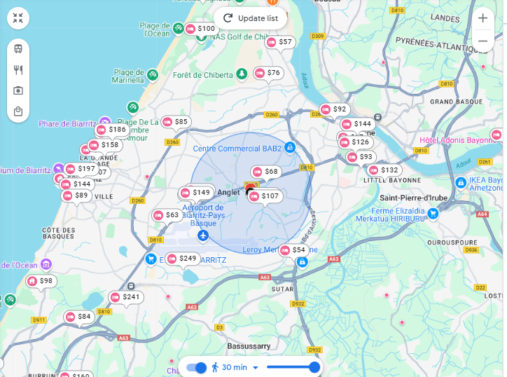

L'édition 2026 de Compas aura lieu du mardi 30 juin au samedi 04 juillet
2026 à Anglet, sur le [Campus Montaury d'Anglet](https://organisation.univ-pau.fr/fr/decouvrir-l-uppa/les-campus/campus-d-anglet.html).

IUT de Bayonne et du Pays Basque 
2 Allée du Parc Montaury 
64600 Anglet  

<iframe width="425" height="350" src="https://www.openstreetmap.org/export/embed.html?bbox=-1.5115588903427126%2C43.47644917979711%2C-1.506301760673523%2C43.47892101205069&amp;layer=mapnik&amp;marker=43.477685108563605%2C-1.5089303255081177" style="border: 1px solid black"></iframe> <small><a href="https://www.openstreetmap.org/?mlat=43.477685&amp;mlon=-1.508930#map=19/43.477685/-1.508930">View Larger Map</a></small>

<!-- Voir détails: [OpenStreetMap](  https://www.openstreetmap.org/?mlat=44.844978&amp;mlon=-0.557524#map=19/44.844978/-0.557524) / [Google Maps](https://maps.app.goo.gl/2g4kc4Bubz1oJgDs8) -->
<!-- {: style="text-align: center;"} -->

<!-- #### Maintenance de la ligne A -->

<!-- **Attention** : une **maintenance** de la ligne **A** est prévue pendant -->
<!-- la durée de la conférence au niveau du [Pont de -->
<!-- Pierre](https://www.infotbm.com/sites/default/files/medias/images/GD_PLAN_TRAM_2023_HD_0.jpg) -->
<!-- reliant le coeur du centre ville de Bordeaux (rive gauche) à la rive -->
<!-- droite où se situe la conférence. Cela correspond à la partie entre -->
<!-- les arrêts consécutifs *Porte de Bourgogne* (rive gauche) et -->
<!-- *Stalingrad* (rive droite). -->

<!-- Un *bus relais* est prévu. -->

## Venue

### Depuis la gare de Bayonne

#### Bus T1, 3, 7 (puis 10 minutes à pied)

La gare de Bayonne est située en plein centre-ville. Il y a des trains en provenance de Bordeaux, Paris, Toulouse... Toutes les informations au sujet de la gare de Bayonne sont disponibles sur [ce site internet](https://www.garesetconnexions.sncf/fr/gares-services/bayonne)

L'option la plus simple est de prendre au choix le bus T1, 3 ou 7 depuis la gare de Bayonne et de descendre à l'arrêt Bernain-Montòri, puis de marcher environ 10 minutes pour arriver au campus.

ℹ️ Depuis Paris, le train est 80 fois moins polluant que l'avion, 77 fois moins qu'un voyage seul en voiture thermique ou bien 36 fois moins qu'un voyage seul en voiture électrique ([Sources](https://impactco2.fr/outils/transport/itineraire?itineraireStart=Paris France&itineraireEnd=Campus Montaury - Université de Pau et des pays de l'Adour Avenue de Maignon Anglet 64600 France&roundTrip=true&defaultMode=comparison&language=fr)).

### En voiture

Par l'autoroute, vous pouvez rejoindre la ville d'Anglet via l'A63 (Paris - Bordeaux) ou l'A64 (Toulouse - Pau).

ℹ️ Pensez au co-voiturage et économisez jusqu'à 80% des émissions carbones en covoiturant avec 4 autres personnes ! ([Sources](https://impactco2.fr/outils/transport/itineraire?itineraireStart=Paris France&itineraireEnd=Campus Montaury - Université de Pau et des pays de l'Adour Avenue de Maignon Anglet 64600 France&roundTrip=true&defaultMode=comparison&language=fr))

### Depuis l'aéroport de Biarritz Pays Basque
Le Pays Basque est très bien desservi par les transports aériens. L’aéroport Biarritz Pays Basque accueille plusieurs vols quotidiens vers et en provenance de Paris, d'autres villes de province ou de l'étranger. Retrouvez les plans de vol en cours sur [le site web de l'aéroport](https://www.biarritz.aeroport.fr).

Pour information, la ligne de bus numéro 3 et numéro 11 du réseau de transports urbains [Txik Txak](http://txiktxak.fr/) vous permet directement de [rejoindre le campus](https://biarritz.aeroport.fr/fr/parking-transport/bus/).

ℹ️ L'impact carbone d'un aller retour en avion depuis Paris équivaut à 345kg CO2e, soit en une semaine 17% du budget annuel disponible pour se déplacer, se nourrir, se loger, consommer et bénéficier des services publics.
Ou bien l'équivalent de 140 141 emails, 36 To de données téléchargées, 280 488 recherches sur le web, 5389 heures de streaming vidéo, 6046 heures de visioconférences, 548 marathons des films Harry Potter en streaming, ou bien 885 repas végétaliens, de quoi manger pendant 2 ans et 5 mois ([Sources](https://impactco2.fr/outils/comparateur?value=345&comparisons=email,telechargement,rechercheweb,streamingvideo,visioconference,repasvegetalien,2050,harry-potter&language=fr)).

### Quelques hébergements possibles (à titre indicatif)

Il y a de nombreux hotels localisé à 30 minutes à pied autour du lieu de la conférence.

#### Hébérgements proches de la conférence

- [Hotel Résidence Anglet Biarritz-Parme](https://www.residence-anglet-biarritz.com/) (+33559528765) - 13 Rue Tour de Sault, 64100 Bayonne, France (550 m)

- [Kyriad Anglet Biarritz](https://anglet.kyriad.com/fr-fr) (+33559521122) - 10 All. du Cadran, 64600 Anglet, France (1.1 km)

- [Ibis Biarritz-Anglet Aéroport](https://all.accor.com/hotel/2555/index.fr.shtml) (+33892680493) - 70, Avenue D'Espagne, Rn 10, 64600 Anglet, France (1.9 km)

#### Autres hébergements à Bayonne

- [Le Bayonne Hôtel & Spa](http://www.biarritz-thalasso.com/hotels/hotel-le-bayonne) (+33559527585) - 1, av Jean Rostand 64100 Bayonne (3.5 km)

- [Mercure Bayonne Centre - Le Grand Hôtel](https://le-grand.hotels-aquitaine.com/) - 21 Rue Thiers, 64100 Bayonne, France (3.7 km)

- [Hôtel ibis Styles Bayonne Gare Centre](http://www.ibis.com/fr/hotel-8716-ibis-styles-bayonne-gare-centre/index.shtml) (+33559503838) - 46 Bd Alsace Lorraine, 64100 Bayonne, France (5.1 km)

- [Hôtel Côte Basque – Bayonne](http://www.hotel-cotebasque.fr/) (+33559551021) - 2 Rue Maubec, 64100 Bayonne, France (4.3 km)

- [Hôtel Des Arceaux – Bayonne](https://www.hotelarceaux.fr/) (+33559591553) - 26 Rue Port Neuf, 64100 Bayonne, France (3.7 km)

- [Hôtel Des Basses Pyrénées – Bayonne](https://www.hotel-bassespyrenees-bayonne.com/) (+33559257088) - 13 Rue Tour de Sault, 64100 Bayonne, France (3.2 km)

[Airbnb](airbnb.fr) also offers many local accommodations.